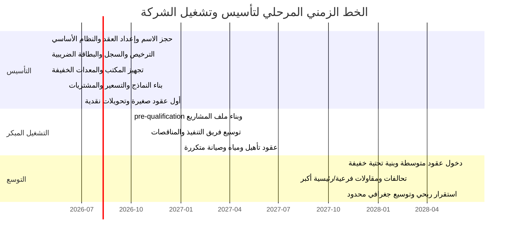

# دراسة تأسيس شركة النقلة الهندسية للمقاولات العامة في محافظة مأرب

## الملخص التنفيذي

الفرصة السوقية لتأسيس **شركة النقلة الهندسية للمقاولات العامة** في مأرب قوية، لكن النجاح لن يأتي من دخول السوق كمقاول عام “يعمل في كل شيء” من اليوم الأول، بل من تأسيس شركة صغيرة–متوسطة منضبطة إداريًا وماليًا، تبدأ بخدمات ذات طلب ظاهر في مأرب: أعمال المباني، التأهيل، المياه والصرف الصحي، الأعمال الترابية والطرق الداخلية، والصيانة، ثم تتوسع لاحقًا إلى عقود البنية التحتية الأكبر والاستشارات الهندسية. هذا الاستنتاج مدفوع بثلاث حقائق: الضغط السكاني الكبير في مأرب، والحاجة المستمرة إلى خدمات ومرافق عامة، ووجود تدفقات تمويل وطنية ودولية موجهة إلى الطرق والمياه والخدمات الحضرية والتعافي المحلي. وتشير بيانات ميدانية أممية إلى أن ما يصل إلى 90% من سكان محافظة مأرب البالغين نحو 1.6 مليون نسمة هم نازحون داخليًا، ما يعني طلبًا مرتفعًا ومستمرًا على السكن والخدمات الأساسية والبنية الحضرية. كما أن السلطة المحلية اعتمدت في 2024 مصفوفة احتياجات تشمل الكهرباء والمياه والصرف الصحي والتعليم المهني والطرق والتكيف المناخي، وفي 2026 بدأت أو استمرت مشاريع فعلية في المياه والصرف الصحي والمباني الخدمية داخل المحافظة. citeturn39search6turn25search2turn46search0turn46search1turn46search3

على المستوى الوطني، لا توجد سلسلة إحصائية عامة حديثة وموثوقة تسمح بإعطاء “حجم سوق” دقيق وحديث لقطاع المقاولات في اليمن؛ لذلك فالأدق عمليًا هو التعامل مع **حجم الفرصة** عبر مؤشرات الطلب والمشاريع الممولة، لا عبر رقم واحد جامد. تاريخيًا، كان قطاع التشييد والمقاولات ذا وزن اقتصادي كبير؛ فقد ساهم القطاع الأوسع للبناء بنحو 275 مليار ريال يمني في الناتج المحلي عام 2009، وبنحو 6.3% من الناتج في 2010، مع تقديرات توظيف مباشر وغير مباشر تجاوزت مليوني عامل. أما حاليًا، فمؤشرات الطلب الحديثة تشمل مشروعات حضرية ممولة من entity["organization","البنك الدولي","multilateral lender"]، وبرامج طرق ينفذها entity["organization","مكتب الأمم المتحدة لخدمات المشاريع","un project services"]، وبرامج تعافٍ اقتصادي وبنية مجتمعية ينفذها entity["organization","برنامج الأمم المتحدة الإنمائي","un development programme"]، إلى جانب حزمة سعودية رسمية في 2026 تضم 28 مشروعًا ومبادرة بقيمة إجمالية 1.9 مليار ريال سعودي لدعم التعافي والخدمات الأساسية في اليمن. citeturn43view0turn45view0turn45view1turn45view2turn29search4

الهيكل الأنسب للشركة في هذه المرحلة هو **شركة ذات مسؤولية محدودة**، لأن الخدمة الحكومية المعلنة تسمح بهذا الشكل لعدد شركاء يتراوح بين 2 و30 شريكًا، مع مسار إلكتروني واضح، ورسوم وزمن إنجاز محددين، وحاجة لاحقة إلى إشهار السجل التجاري والبطاقة الضريبية والتصنيف المهني للمقاول. أوصي أيضًا باستراتيجية **rental-first** في أول 12 شهرًا: شراء حد أدنى من المركبات والأدوات وأجهزة الرفع والقياس، واستئجار المعدات الثقيلة بحسب كل مشروع، لأن القطاع في اليمن لا يزال يواجه مخاطر أمنية وتشريعية وتمويلية وتقلبات صرف، ولأن الاحتفاظ بسيولة تشغيلية أهم في البداية من التوسع السريع في الأصول الثابتة. citeturn18view0turn34view0turn18view2turn18view3turn33search1turn33search2turn43view2turn43view3

هذه الدراسة تقترح **نموذجًا تأسيسيًا محافظًا**: رأس مال مبدئي مستهدف قدره **200 ألف دولار** تقريبًا في السيناريو الأساسي، منها نحو **68 ألف دولار** تجهيزات وإطلاق، و**132 ألف دولار** رأس مال عامل. كما تفترض إيرادات تشغيلية أولية في السنة الأولى بحدود **480 ألف دولار**، ترتفع إلى **1.15 مليون دولار** في السنة الثانية و**2.1 مليون دولار** في السنة الثالثة إذا التزمت الشركة بالتركيز القطاعي، وانضباط التسعير، وبناء ملف تأهيلي قوي للمناقصات والعقود الخاصة. جميع الأرقام المالية الواردة أدناه **افتراضية** ومبنية على افتراضات صريحة، وليست أسعار سوق منشورة. ولأغراض المعايرة المحلية استخدمت الدراسة افتراضًا مرجعيًا قدره **1 دولار ≈ 1,560 ريال يمني**، وهو قريب من المستوى الذي أوردته نشرات السوق الأممية لمناطق الحكومة في أوائل 2026. citeturn17search13turn17search5

## الرؤية والتموضع الاستراتيجي

الرؤية المقترحة للشركة هي: **أن تصبح خلال ثلاث سنوات مقاولًا محليًا موثوقًا في مأرب، معروفًا بالالتزام والشفافية وسرعة الإنجاز في مشاريع المباني والخدمات الحضرية والمياه والصيانة، مع قابلية حقيقية للتوسع إلى مشاريع البنية التحتية والاستشارات الهندسية**. هذه الرؤية أكثر واقعية من محاولة تقليد الشركات الإقليمية الكبرى منذ البداية؛ لأن السوق المحلي الجاري في اليمن يكافئ المقاول الذي يستطيع التنفيذ في بيئة معقدة، وضبط التكلفة، والوفاء بالمستندات والمتطلبات التعاقدية، أكثر من المقاول الذي يملك صورة دعائية أكبر من قدرته التشغيلية. citeturn43view0turn43view2turn45view0turn45view2

الرسالة المقترحة: **تقديم أعمال مقاولات وخدمات هندسية عملية وآمنة وقابلة للتتبع، تلبي أولويات مأرب في السكن والخدمات والمياه والطرق والصيانة، مع إدارة مشروع منضبطة، وتوثيق فني ومالي واضح، واعتماد أكبر ممكن على الكفاءات المحلية**. وهذا التموضع ينسجم مع ما تظهره مشروعات التعافي الحضرية والريفية في اليمن من تركيز على البناء التدريجي للقدرات المحلية، والعمالة، والتشغيل، واستعادة الخدمات الأساسية، بدلًا من الحلول الضخمة غير المرنة. citeturn45view0turn45view1turn45view2

### الأهداف خلال أول ثلاث سنوات

| الهدف | مستهدف مرحلي |
|---|---|
| إكمال التأسيس القانوني والتشغيلي | خلال أول 90 يومًا |
| الحصول على أول 3 عقود مدفوعة | خلال 6 أشهر |
| تكوين ملف مشاريع موثق بالصور والمستخلصات والشهادات | 5–8 مشاريع خلال 18 شهرًا |
| رفع الإيرادات السنوية | من 480 ألف دولار إلى 1.15 مليون ثم 2.1 مليون |
| المحافظة على هامش إجمالي مستهدف | 22%–26% في المتوسط |
| تقليل الاعتماد على عميل واحد | ألا تتجاوز حصة أكبر عميل 35% من الإيراد السنوي |
| حوادث جسيمة مفقودة الوقت | صفر |
| إعادة الأعمال بسبب الجودة | أقل من 2% من قيمة العقد |
| نسبة تحصيل المستحقات خلال 75 يومًا | 80% فأكثر |

### باقات الخدمات المقترحة

| الباقة | ما تتضمنه | العميل المستهدف | نموذج التسعير المقترح | نطاق سعري إرشادي |
|---|---|---|---|---|
| إنشاءات عامة | هياكل خرسانية، مبانٍ سكنية وتجارية صغيرة–متوسطة، مباني خدمية | ملاك، تجار، جهات محلية، منظمات | عقد مقطوعية أو BOQ | 80–400 ألف دولار للمشروع |
| تشطيبات وتأهيل | تشطيب داخلي وخارجي، إعادة تأهيل، عوازل، واجهات، تحسين وظيفي | مكاتب، مدارس، عيادات، ملاك | تسعير بالمتر/بند/مقطوعية | 20–150 ألف دولار |
| بنية تحتية خفيفة | شبكات مياه وصرف، خزانات، رصف داخلي، تصريف أمطار، أعمال ترابية | سلطة محلية، منظمات، مطورون | BOQ ومراحل صرف | 120–600 ألف دولار |
| استشارات هندسية | رفع مساحي، دراسات، مخططات، حصر كميات، إشراف | أفراد، منشآت، جهات منفذة | أتعاب ثابتة أو نسبة من قيمة المشروع | 2–25 ألف دولار أو 3%–7% |
| صيانة وتشغيل | صيانة دورية، إصلاحات، عقود تشغيل خفيفة للمباني والمرافق | مدارس، مراكز، مجمعات، تجار | شهري/ربع سنوي/بالطلب | 1–10 آلاف دولار شهريًا أو 10–100 ألف دولار للعقد |

**ملاحظة منهجية:** هذه النطاقات **افتراضية تخطيطية** لتأسيس نموذج العمل، وليست نطاقات أسعار منشورة من السوق أو من المنافسين.

## السوق والطلب والمنافسة

### مؤشرات الطلب الفعلية في مأرب واليمن

| المؤشر | ما الذي يعنيه للشركة | المصدر |
|---|---|---|
| ملف أممي لمأرب أشار إلى أن نحو 1.6 مليون شخص في المحافظة، وأن ما يصل إلى 90% من السكان نازحون داخليًا | ضغط مرتفع على السكن، المياه، الصرف، المدارس، المراكز الصحية، والطرق الحضرية | citeturn39search6 |
| مصفوفة احتياجات مأرب المعتمدة في 2024 شملت الكهرباء والمياه والصرف الصحي والتعليم المهني والطرق والتكيف المناخي | قائمة طلب محلي واضحة في القطاعات التي يمكن للشركة دخولها | citeturn25search2 |
| في أبريل 2026 تم التسليم الرسمي لموقع إنشاء محطة معالجة لمشروع صرف صحي في مديرية حريب بتمويل مشترك محلي–تنموي | وجود عقود WASH ومشاريع إنشائية فعلية في المحافظة | citeturn46search0 |
| مشروع تعزيز الأمن المائي في مأرب يشمل 7 خزانات برجية وتمديد شبكات توزيع خلال 18 شهرًا | قطاع المياه من أكثر القطاعات القابلة للدخول المبكر للشركة | citeturn46search3 |
| افتتاح مبنى قصر مؤتمرات في مأرب بكلفة مليون دولار في أبريل 2026 | استمرار الطلب على المباني الخدمية والمؤسسية | citeturn46search1 |
| مشروع الخدمات الحضرية الطارئة في اليمن من البنك الدولي بدأ بـ150 مليون دولار، وحقق في مرحلته الأولى 240 كم طرق و1.2 مليون مستفيد من خدمات WASH | الطلب الوطني على المقاولين في الطرق والخدمات الحضرية حقيقي وممول | citeturn45view0 |
| مشروع الربط الحيوي للطرق في اليمن الممول من البنك الدولي والمنفذ عبر UNOPS بقيمة 50 مليون دولار حتى يونيو 2026 | فرص مباشرة أو غير مباشرة في الطرق الريفية والأعمال الملحقة | citeturn45view1 |
| البرنامج السعودي لتنمية وإعمار اليمن أعلن في يناير 2026 عن 28 مشروعًا ومبادرة بقيمة 1.9 مليار ريال سعودي | استمرار تدفق مشاريع خدمية وتنموية على المستوى الوطني | citeturn29search4 |

الاستنتاج العملي من الجدول أعلاه أن **أقوى نقطة دخول** للشركة ليست الأعمال العملاقة ولا التنافس المبكر على المشاريع الثقيلة جدًا، بل العقود الصغيرة والمتوسطة التي تقع في تقاطع: **المباني الخدمية + تأهيل المرافق + WASH + الطرق الداخلية + الصيانة**. هذا التمركز يمنح الشركة سرعة دوران أعلى، واحتياجًا أقل لرأس المال الثابت، وإمكانية أسرع لبناء سجل أعمال قابل للتسويق لاحقًا. citeturn25search2turn46search0turn46search3turn45view0turn45view1

### مقارنة الشركات القوية والمراجع الرقمية

> **مهم:** السوق المحلي في اليمن **مجزأ** ويضم عددًا كبيرًا من المقاولين والموردين والمهندسين المسجلين أو المعلنين عبر entity["organization","الاتحاد العام للمقاولين اليمنيين","yemen contractors union"]، بينما الحضور الرقمي الاحترافي لا يزال محدودًا نسبيًا؛ لذلك يجمع الجدول بين شركات يمنية ذات حضور رقمي وشركات إقليمية مرجعية مفيدة في فهم معايير العرض المؤسسي والتموضع. citeturn30search0turn30search3turn30search6

| الشركة | الخدمات المعروضة | مشاريع/قطاعات نموذجية | نقاط القوة الظاهرة | الموقع الإلكتروني | التسعير/النطاق المنشور | المصدر |
|---|---|---|---|---|---|---|
| entity["company","الشركة اليمنية للهندسة والمقاولات العامة","yemen contractor"] | مقاولات وتوريدات، أعمال مدنية وإنشائية، صيانة وعوازل، دراسات وتصاميم، استشارات هندسية | يعرض أقسامًا للمشاريع والورش والإعلانات | عرض خدمات متكامل يجمع التنفيذ مع التصميم والاستشارة | `yengc.com` | غير معلن علنًا | citeturn11search3turn11search17 |
| entity["company","مجموعة العمودي اليمنية للمقاولات والتجارة المحدودة","construction yemen"] | دراسات وتصاميم، تنفيذ مشاريع هندسية، استشارات | موانئ، مطارات، جسور، طرق، أعمال إنشائية | تموضع قوي في المشاريع الكبيرة والبنية التحتية | `alamoudi-ayg.com` | غير معلن علنًا | citeturn11search13 |
| entity["company","مكتب بن علوان للهندسة والمقاولات","taiz contractor"] | مقاولات، هندسة وتصاميم، دراسات واستشارات | رصف طريق، ترميم وإعادة تأهيل كلية | يبرز “آخر الأعمال” بشكل مباشر وواضح | `binalwancontractingandengineering.com` | غير معلن علنًا | citeturn11search16 |
| entity["company","مؤسسة بوابة إنجاز للهندسة والمقاولات العامة","yemen general contractor"] | مبانٍ سكنية، ترميم، عوازل، صبات أرضيات، مصانع وهناجر | تركيز على الأعمال الخاصة والمباني | تموضع تسويقي واضح للأعمال السكنية والخفيفة | `enjazgateye.com` | غير معلن علنًا | citeturn11search2 |
| entity["company","المقاولون العرب","egypt construction company"] | مبانٍ عامة، جسور، طرق، أنفاق، مطارات، إسكان، مياه وصرف، محطات معالجة، استشارات | مشاريع قطاعية واسعة في الشرق الأوسط وأفريقيا | موقع مؤسسي غني بالمشاريع والخدمات والأخبار والمواقع | `arabcont.com` | غير معلن علنًا | citeturn12search0turn12search15 |
| entity["company","حسن علام القابضة","egypt holding company"] | هندسة وإنشاءات، تطوير واستثمار، EPC، مياه وطرق وبنية تحتية، مرافق | يعرض شركات تابعة، أخبار، استدامة، مشاريع | عرض مؤشرات الحجم والحوكمة والاستدامة والوظائف | `hassanallam.com` | غير معلن علنًا | citeturn13search1turn13search2turn13search4 |
| entity["company","المباني","saudi infrastructure company"] | بنية تحتية، أعمال مدنية وكهروميكانيكية، مشروعات مطارات وبنية كبيرة | مشاريع طيران وبنية تحتية واسعة النطاق | تموضع واضح كمقاول بنية تحتية متخصص | `almabani.com` | غير معلن علنًا | citeturn12search2turn12search20 |

أهم ما تعرضه المواقع القوية ليس “الأسعار”، بل **القدرة**: القطاعات، نماذج المشاريع، الخبرة، السلامة/الاستدامة، الأخبار، الوظائف، ونقاط التواصل. المواقع اليمنية التي وُجدت تركز أكثر على **سرد الخدمات وآخر الأعمال والتواصل المباشر**، بينما تضيف المواقع الإقليمية طبقات أقوى من **حوكمة الشركات، مؤشرات الحجم، التخصص القطاعي، والاستدامة**. بالنسبة لشركة ناشئة في مأرب، فهذا يعني أن التمايز التجاري في أول 18 شهرًا يجب أن يبنى على: **ملف مشاريع منظم، صور تنفيذ، BOQs دقيقة، شهادات إنجاز، وسيرة فرق العمل** أكثر من أي إنفاق دعائي كبير. citeturn11search3turn11search13turn11search16turn12search0turn13search2turn12search2

## الإطار القانوني والحوكمة والموارد البشرية

### الهيكل القانوني المقترح ومسار التأسيس

الهيكل القانوني الأنسب في هذه الحالة هو **شركة ذات مسؤولية محدودة** عبر خدمة entity["organization","وزارة الاقتصاد والصناعة والاستثمار","yemen trade ministry"] المعلنة على البوابة الإلكترونية. الخدمة تنص على أن مقدم الطلب يُفضل أن يكون أحد الشركاء، وأن عدد الشركاء لا يقل عن 2 ولا يزيد على 30، وأنه بعد صدور قرار الترخيص والمصادقة على النظام الأساسي يجب استكمال إجراءات الإشهار في السجل التجاري من الحساب نفسه. كما أن خدمة حجز الاسم التجاري للشركات متاحة لمدة 60 يومًا. وتذكر صفحة الخدمة أن مدة التنفيذ يوم واحد، ورسوم الخدمة 46,340 ريالًا يمنيًا، وأجور النشر والإشهار 196,000 ريال يمني، مع إتاحة الدفع عبر محفظة “موبايل موني”. citeturn18view0turn18view2turn34view0turn34view1

بعد الترخيص، يلزم عمليًا استكمال **السجل التجاري للشركة**، ثم التسجيل الضريبي لدى entity["organization","مصلحة الضرائب اليمنية","aden tax authority"]. وتُظهر بوابة المصلحة وجود قانون ضريبة الدخل رقم 17 لسنة 2010 وقانون الضريبة العامة على المبيعات رقم 19 لسنة 2001 وخدمات تسجيل إلكترونية. كما يشير دليل أعمال منشور عن اليمن إلى أن المعدل العام الشائع لضريبة الشركات هو 20%، وأن الضريبة العامة على المبيعات 5% في القاعدة العامة مع استثناءات، وأن البطاقة الضريبية تُطلب عند التعاقد أو الترخيص أو التجديد؛ لكن **يجب التحقق محليًا قبل التسعير النهائي للعقود** لأن التطبيق العملي والإعفاءات قد يختلفان حسب نوع العقد والجهة والموقع. citeturn21view0turn42view0turn42view1

إذا كانت الشركة تستهدف المناقصات العامة أو المشاريع الرسمية، فينبغي إضافة **مسار تصنيف وتسجيل المقاول** لدى جهة الأشغال المختصة. شذرات الخدمة الرسمية المنشورة تشير إلى أن متطلبات التصنيف تشمل البطاقة الضريبية والسجل التجاري ورخصة مزاولة المهنة، إضافة إلى وثائق ملكية المعدات والآلات، وإثباتات المقدرة المالية، وشهادات الكادر الهندسي والإداري. وعلى المستوى المحلي في مأرب، تعرض البوابة الرقمية للمدينة خدمات مرتبطة بالأشغال تشمل تراخيص البناء، رخصة مزاولة المهنة، رخص الحفر، وتصاريح متصلة بالأعمال الميدانية، مع دورة معالجة تتضمن تقديم الطلب، مراجعة أولية، تقييم فني، ثم إصدار. citeturn33search1turn33search2turn32view1

### الحوكمة المقترحة منذ اليوم الأول

أوصي بفصل واضح بين **الملكية** و**الإدارة**. حتى لو كان الشركاء نشطين في التنفيذ اليومي، يجب أن توجد وثيقتان منفصلتان:  
أولًا، **عقد التأسيس/النظام الأساسي** الرسمي.  
ثانيًا، **اتفاقية شركاء** داخلية غير مختصرة، تنظم: نسب التمويل، صلاحيات التوقيع البنكي، من يوافق على المناقصات، حدود الشراء النقدي، آلية توزيع الأرباح، سياسة السحب الشخصي، دخول شريك جديد، الخروج أو الوفاة أو العجز، ومنهج فض النزاع. هذه النقطة حاسمة في شركات المقاولات الناشئة لأن أكثر أسباب التعثر المبكر ليست فنية بل **إدارية–مالية**. هذا الاستنتاج متسق مع الأدبيات الحديثة حول القطاع في اليمن التي تبرز مشكلات التشريع الضعيف والفساد وتشتت المسؤوليات وصعوبات السيولة. citeturn43view2turn43view3

### الهيكل البشري المقترح بحسب المراحل

| المرحلة | الوظائف الأساسية | العدد المقترح |
|---|---|---|
| التأسيس | مدير عام/شريك تنفيذي، مدير مشاريع/عمليات، مهندس موقع، حاسب كميات/تسعير، محاسب وإدارة، مشتريات ولوجستيات، مسؤول جودة وسلامة، مساعد إداري/مخزن، سائقان/مراسل | 9–10 |
| التشغيل المبكر | إضافة مهندس موقع ثانٍ، معماري/MEP جزئي، مسؤول تطوير أعمال ومناقصات، مسؤول موارد بشرية وإدارة، مسّاح، فورمانان، مسؤول مخزن إضافي | 16–20 |
| التوسع | إضافة مدير قطاع بنية تحتية، مسؤول عقود ومطالبات، مهندس تخطيط، مسؤول معدات، مسؤول تحصيل وعلاقات عملاء، فريق QA/QC أوسع | 24–32 |
| العمالة المتغيرة | نجارون، حدادون، عمال خرسانة، بلاط، دهان، سباكة، كهرباء، عمالة عامة بحسب كل مشروع | 15–120 حسب الحمولة |

**مبدأ التوظيف:**  
في أول 12 شهرًا، يجب أن تكون الرواتب الثابتة قليلة، ويُنقل أكبر قدر من العمالة التنفيذية إلى **عقود مشروع/يومية/مقطوعية** مع فورمانات موثوقين. هذا يخفف الضغط النقدي ويحافظ على المرونة التشغيلية.

## الخطة التشغيلية المرحلية

### مرحلة التأسيس

الهدف في أول 6 أشهر ليس “الربحية القصوى”، بل **بناء آلة التنفيذ**: التأسيس القانوني، ضبط النماذج والعقود، رفع الجاهزية الفنية، وإنجاز أول مشاريع صغيرة بصورة ممتازة وموثقة. هذا الترتيب منطقي لأن السوق اليمني الحالي يفضّل المقاول القادر على العمل مع المستندات والامتثال والسلامة في بيئة متقلبة، وهي عناصر تظهر بقوة في مشاريع البنك الدولي وUNOPS وUNDP العاملة في اليمن. citeturn45view0turn45view1turn45view2turn43view3

### مرحلة التشغيل المبكر

الهدف بين 6 و18 شهرًا هو تحويل الشركة من “اسم ناشئ” إلى **مورد/مقاول مُسبق التأهيل** لدى عدد من العملاء الثابتين في مأرب، مع ملف مشاريع وعمليات داخلية واستقرار في التحصيل. هنا يجب أن تنتقل الشركة من المشاريع الفردية الصغيرة إلى حزمة متوازنة من: عقود مبانٍ، عقود تأهيل، عقدين أو ثلاثة WASH/طرق داخلية، وعقود صيانة متكررة. citeturn25search2turn46search0turn46search3turn45view0

### مرحلة التوسع

الهدف بين 18 و36 شهرًا هو بناء **محفظة أعمال** تمنح الشركة القدرة على دخول مناقصات أكبر، أو التحالف كمقاول شريك/منفذ فرعي مع شركات أكبر، خصوصًا في البنية التحتية الخفيفة والطرق والمياه والمشاريع المؤسسية المتوسطة. في هذه المرحلة يصبح وجود نظام ضبط جودة، وسجل سلامة، ومطالبات تعاقدية، وتحكم بالتكلفة، أمورًا حاسمة، لا كماليات. citeturn45view1turn43view3turn16search0turn16search20

### خريطة العمل المرحلية ومؤشرات الأداء

| المرحلة | الأعمال الرئيسية | المخرجات المتوقعة | KPIs |
|---|---|---|---|
| 0–6 أشهر | تأسيس قانوني، اتفاقية شركاء، فتح حسابات، شراء حد أدنى من المعدات، بناء النماذج والعقود، إطلاق تسويق ميداني، تنفيذ 1–3 مشاريع صغيرة | شركة مسجلة، ملف تشغيلي، أول عملاء، أول صور وشهادات إنجاز | 3 عقود، >85% تسليم في الوقت، 0 حادث جسيم، 10 عروض سعر/شهر |
| 6–18 شهرًا | pre-qualification، توسعة الفريق، بناء شبكة موردين، دخول عقود WASH/طرق/تأهيل، تحسين التحصيل | 5–8 مشاريع مكتملة، قاعدة موردين معتمدة، عميلان متكرران | إيراد سنوي 1.15 مليون دولار، هامش إجمالي ≥24%، DSO ≤75 يومًا، إعادة أعمال <2% |
| 18–36 شهرًا | توسعة تدريجية، وحدة بنية تحتية، تحسين نظام التخطيط والعقود، تحالفات، توسيع جغرافي محدود | شركة قادرة على عقود متوسطة وتحالفات ناجحة | إيراد سنوي 2.1 مليون دولار، 30% من الإيراد من عملاء متكررين، نسبة فوز بالعطاءات ≥20% |

### الخط الزمني التنفيذي

يبني هذا الخط الزمني على المدد الرسمية الأساسية للتسجيل والترخيص، وعلى منطق التوسع المرحلي المرتبط بحجم المشاريع المعروضة محليًا ووطنيًا. citeturn34view0turn18view2turn32view1turn45view0turn45view1

## الخطة المالية المبدئية

### الافتراضات الصريحة

هذه الخطة المالية **سيناريو تأسيسي محافظ** وليست موازنة نهائية. افتراضاتها الرئيسة كالتالي:

| الافتراض | القيمة |
|---|---|
| العملة المرجعية | الدولار الأمريكي |
| سعر المعايرة المحلي | 1 دولار = 1,560 ريال يمني تقريبًا |
| نموذج التشغيل | شراء حد أدنى من الأصول + استئجار المعدات الثقيلة بحسب المشروع |
| العقود المستهدفة في السنة الأولى | صغيرة إلى متوسطة، خاصة ومحلية وتعاقدات خدمية |
| متوسط هامش الربح الإجمالي المستهدف | 26% في السنة الأولى، ثم 28%، ثم 30% تقريبًا |
| التحصيل | سلف/دفعات مقدمة + مستخلصات دورية + احتجاز جزء من المستحقات |
| المعالجة الضريبية في النموذج | **قبل الضريبة** تشغيليًا، مع وجوب مراجعة ضريبة الدخل/المبيعات محليًا قبل التسعير النهائي |

التحفظ في المعالجة الضريبية مقصود، لأن القوانين والمنصات منشورة رسميًا، لكن التطبيق العملي على العقود والمقاولين والخصومات قد يتأثر بطبيعة الجهة المتعاقدة والموقع والإعفاءات وشروط التوريد. وفي الأدبيات المنشورة عن اليمن يرد معدل عام شائع لضريبة الشركات 20% ومعدل عام للضريبة على المبيعات 5% مع استثناءات. citeturn17search13turn17search5turn21view0turn42view0turn42view1

### رأس المال المطلوب

| البند | دولار |
|---|---:|
| رسوم تأسيس، قانوني، توثيق، أختام ونماذج | 2,000 |
| مقدم إيجار المكتب والتجهيز الداخلي | 10,000 |
| مركبتان بيك أب + وسائل حركة خفيفة | 28,000 |
| أدوات ومعدات خفيفة وسقالات وبداية فورم وPPE | 15,000 |
| أجهزة مساحية/فحص/كمبيوتر وطابعات | 8,000 |
| برمجيات، اتصال، هوية مؤسسية، نماذج مناقصات | 5,000 |
| احتياطي إطلاق ومخاطر غير متوقعة | 0–5,000 |
| **إجمالي التجهيز والإطلاق** | **68,000** |
| **رأس مال عامل مستهدف** | **132,000** |
| **إجمالي رأس المال الموصى به** | **200,000** |

**قراءة عملية:** 200 ألف دولار تعادل تقريبًا **312 مليون ريال يمني** وفق افتراض الصرف المستخدم. ويمكن خفض الدخول إلى حدود 140–160 ألف دولار إذا كانت الشركة ستؤجل شراء جزء من المركبات والأدوات، لكن ذلك يرفع حساسية المشاريع الأولى لأي تأخير في التحصيل أو زيادة في الكلفة. citeturn17search13

### التكاليف الثابتة والمتغيرة السنوية في السنة الأولى

| التكاليف الثابتة السنوية | دولار |
|---|---:|
| رواتب الطاقم الأساسي ومخصصاته | 72,000 |
| إيجار المكتب والخدمات | 12,000 |
| اتصالات، إنترنت، برامج، طباعة وأرشفة | 4,500 |
| وقود وصيانة إدارية للمركبات | 6,000 |
| تطوير أعمال، تنقلات، استضافة عملاء، زيارات مواقع | 6,000 |
| قانوني، محاسبة، تدقيق، رسوم تجديدات | 5,500 |
| احتياطي إداري ومخاطر | 7,000 |
| **الإجمالي** | **113,000** |

| التكاليف المتغيرة المباشرة | نسبة إرشادية من الإيراد |
|---|---:|
| مواد ومشتريات مباشرة | 48%–55% |
| أجور موقع وعمالة مباشرة | 10%–14% |
| مقاولون فرعيون ومتخصصون | 5%–10% |
| استئجار معدات وآليات | 5%–8% |
| نقل موقعي ووقود وتوريد | 3%–5% |
| فحوصات، سلامة، مخلفات، حماية موقع | 1%–2% |

### توقعات الإيرادات والربحية لثلاث سنوات

| السنة | الإيرادات | التكلفة المباشرة | الربح الإجمالي | المصروفات التشغيلية الثابتة | الربح التشغيلي التقريبي |
|---|---:|---:|---:|---:|---:|
| الأولى | 480,000 | 355,200 | 124,800 | 113,000 | 11,800 |
| الثانية | 1,150,000 | 828,000 | 322,000 | 192,000 | 130,000 |
| الثالثة | 2,100,000 | 1,470,000 | 630,000 | 285,000 | 345,000 |

هذا السيناريو **محافظ** في السنة الأولى ومقصود كذلك؛ لأنه يفترض أن السنة الأولى ستُستهلك جزئيًا في التأسيس وبناء السمعة والملف الفني، لا في تعظيم الربح. أما القفزة في السنتين الثانية والثالثة فتعتمد على شرطين أساسيين: **التحصيل الجيد** و**القدرة على الفوز بعقود متوسطة دون تآكل الهامش**.

### نقطة التعادل

في هذا النموذج، ومع هامش إجمالي مستهدف يقارب 26% ومصروفات ثابتة سنوية تقارب 113 ألف دولار، تقع **نقطة التعادل التشغيلية** حول **435 ألف دولار إيرادات سنوية** تقريبًا، أي نحو **36 ألف دولار شهريًا** في المتوسط. وعمليًا، هذا يعني أن الشركة تحتاج في مرحلة الاستقرار إلى مزيج من: **عقد مبانٍ أو تأهيل صغير كل شهرين تقريبًا + عقد صيانة/استشارة متكرر** كي تبقى فوق نقطة التعادل.

### جدول التدفق النقدي الشهري للسنة الأولى

> **مهم:** هذا جدول **نقدي** لا ربحي؛ لذلك يتضمن ضخ رأس المال في الشهر الأول، ويعكس تحصيلات فعلية لا إيرادات محاسبية فقط.

| الشهر | المقبوضات النقدية | تكاليف مباشرة | مصروفات ثابتة | CAPEX/إطلاق | صافي التدفق | الرصيد الختامي |
|---|---:|---:|---:|---:|---:|---:|
| الشهر 1 | 200,000 | 0 | 8,000 | 45,000 | 147,000 | 147,000 |
| الشهر 2 | 5,000 | 7,000 | 9,000 | 8,000 | -19,000 | 128,000 |
| الشهر 3 | 15,000 | 14,000 | 9,000 | 5,000 | -13,000 | 115,000 |
| الشهر 4 | 20,000 | 19,000 | 9,000 | 4,000 | -12,000 | 103,000 |
| الشهر 5 | 30,000 | 25,000 | 9,000 | 3,000 | -7,000 | 96,000 |
| الشهر 6 | 38,000 | 28,000 | 9,000 | 2,000 | -1,000 | 95,000 |
| الشهر 7 | 42,000 | 31,000 | 10,000 | 1,000 | 0 | 95,000 |
| الشهر 8 | 47,000 | 35,000 | 10,000 | 0 | 2,000 | 97,000 |
| الشهر 9 | 51,000 | 38,000 | 10,000 | 0 | 3,000 | 100,000 |
| الشهر 10 | 56,000 | 41,000 | 10,000 | 0 | 5,000 | 105,000 |
| الشهر 11 | 61,000 | 45,000 | 10,000 | 0 | 6,000 | 111,000 |
| الشهر 12 | 70,000 | 50,000 | 10,000 | 0 | 10,000 | 121,000 |

**قراءة الجدول:** الشركة تبقى سالبة نسبيًا في أول ستة أشهر من ناحية التشغيل النقدي، ثم تبدأ بالتوازن في الشهر السابع، والتحسن التدريجي بعده. وهذا يفسر لماذا **رأس المال العامل** ليس خيارًا ثانويًا بل هو شرط بقاء.

## التسويق والمبيعات والمشتريات وإدارة المخاطر

### التسويق والمبيعات في مأرب

استراتيجية التسويق الصحيحة هنا **محلية وعملية**، لا دعائية فقط. السوق في مأرب سيشتري من الشركة الجديدة إذا قدمت ثلاثة أشياء بسرعة: **عرض سعر واضح، ملف فني منظم، وثقة في التنفيذ والتحصيل**. قنوات الاكتساب الأكثر جدوى هي:  
القطاع المحلي شبه العام والبلدي؛  
المنظمات والمشاريع التنموية والإنسانية التي تحتاج تنفيذًا ميدانيًا؛  
القطاع الخاص التجاري والسكني؛  
وشبكة الإحالات من المهندسين والموردين والمكاتب.  
هذا التوجه يتماشى مع طبيعة الطلب الظاهر في المحافظة وفي التمويل الوطني الحالي لقطاعات المياه والطرق والخدمات الحضرية والتعافي الاقتصادي. citeturn25search2turn46search0turn46search3turn45view0turn45view1turn45view2

أوصي بتسعير غير “رخيص” بل **قابل للدفاع**، قائم على BOQ وحصر كميات ومخاطر. السياسة المناسبة في أول 18 شهرًا هي:  
- **استشارات وإشراف:** هامش أعلى؛  
- **تشطيبات وتأهيل:** هامش متوسط–جيد؛  
- **مبانٍ وبنية تحتية:** هامش أقل لكن بحجم أكبر؛  
- **صيانة:** أداة ممتازة لبناء علاقة متكررة مع العميل.  
كما أوصي بألا تدخل الشركة أي مناقصة لا تستطيع فيها حماية هامشها الأدنى، لأن خسارة مشروع واحد في البداية قد تستهلك رأسمال التشغيل. هذا مهم خصوصًا في بيئة قطاع ما زالت فيها مخاطر التشريع والسيولة والتأخير مرتفعة. citeturn43view2turn43view3

### المعدات والمواد والموردون المحتملون

| الفئة | موردون/مصادر محتملة | ملاحظة تشغيلية | المصدر |
|---|---|---|---|
| أسمنت | entity["company","الشركة الوطنية للأسمنت","yemen cement producer"]، entity["organization","المؤسسة اليمنية العامة لصناعة وتسويق الأسمنت","state cement producer"] | توريد وطني رسمي؛ يجب التحقق من اللوجستيات إلى مأرب وسعر النقل | citeturn14search0turn14search8turn14search26 |
| حديد تسليح | entity["company","حديد اليمن","yemen steel factory"]، entity["company","حديد مِسك","yemen rebar producer"] | مصانع محلية تحمل عرضًا تقنيًا ومنتجات مطابقة للمعايير المعروضة | citeturn14search2turn14search10turn14search22 |
| خرسانة جاهزة | entity["company","عمران للخرسانة الجاهزة","sanaa ready mix"] أو التعاقد مع batching محلي/موقعي | لمشاريع المباني المتوسطة والتأهيل السريع | citeturn14search1turn14search5 |
| هياكل معدنية وأعمال حديد خفيف/ورش | شركات وطنية متخصصة بالأعمال الحديدية والهناجر مثل Yemen Steel Group | مفيد للمستودعات والورش والهناجر والمباني الخفيفة | citeturn14search6 |
| معدات وآليات | سوق التأجير المحلي، الموردون عبر دليل الاتحاد، ومقاولو المعدات في المحافظات المجاورة | أوصي بالتأجير أكثر من الشراء في أول 12 شهرًا | citeturn30search0turn30search3 |

### إدارة المشاريع والجودة والسلامة المهنية

ينبغي أن تعمل الشركة منذ البداية وفق **دورة مشروع موحدة**:  
استلام طلب/فرصة → زيارة موقع → رفع مساحي وصور → BOQ وتقدير → مراجعة مخاطر وسلامة → اعتماد عرض → عقد وأمر مباشرة → خطة تنفيذ وبرنامج زمني → اعتماد مواد ومورّدين → تنفيذ ومتابعة يومية → مستخلصات → إغلاق وتسليم وضمان. هذا ليس ترفًا إداريًا؛ بل هو شرط مباشر لتقليل إعادة الأعمال والنزاعات والتحصيل المتأخر. وتُظهر مشاريع التعافي الممولة في اليمن أن المؤسسات المحلية الناجحة تبني أثرها عبر هذا النوع من الانضباط المؤسسي، لا عبر التنفيذ العفوي. citeturn45view0turn45view2turn43view3

في السلامة والبيئة، الإطار المرجعي الأدنى يجب أن يجمع بين **قانون العمل اليمني** في باب السلامة المهنية، و**قانون حماية البيئة رقم 26 لسنة 1995** ولائحته التنفيذية، ومرجعيات **IFC/WBG EHS** في البناء. كما تشير أطر الإدارة البيئية والاجتماعية للمشاريع في اليمن إلى أن القانون البيئي يشكل أساس إصدار التصاريح وتقييمات الأثر البيئي، وأن التنفيذ العملي يحتاج خططًا واضحة لإدارة المخلفات، والغبار، والضوضاء، والمياه الراكدة، والزيوت، والتدريب، والإبلاغ عن الحوادث. citeturn16search2turn16search3turn16search20turn15search2turn15search3turn15search18turn16search0turn16search4

أوصي بأن تتبنى الشركة من أول مشروع هذه الوثائق الإلزامية: **سياسة HSE، سجل مخاطر للموقع، محضر induction، toolbox talks أسبوعية، سجل معدات، سجل فحص سقالات، إذن عمل للحفر/الرفع/الكهرباء، سجل NCR/CAR للجودة، ونموذج handover**. كما يجب ألا يدخل أي مورد أو مقاول فرعي الموقع قبل فحص وثائقه وسلامته ومطابقته للتعليمات.

### سجل المخاطر الرئيسي وتدابير التخفيف

| الخطر | لماذا هو مهم | التخفيف المقترح |
|---|---|---|
| تقلب الصرف والأسعار | يؤثر فورًا في الحديد، الأسمنت، الوقود، والنقل | تسعير بعمر عرض قصير، بنود تعديل أسعار في العقود الأطول، ومخزون مدروس للمواد الحرجة |
| تأخر التحصيل والمستخلصات | أكبر سبب لاستنزاف السيولة في المقاولات | دفعة مقدمة، جداول صرف مرحلية، مستخلصات موثقة، سقف ائتماني لكل عميل |
| مخاطر أمنية ووصول للمواقع | قطاع اليمن ما زال يعمل في بيئة نزاع متذبذب | تحليل موقع قبل الدخول، خطة وصول، شرط أمني بالعقد، توقف آمن عند الضرورة |
| ضعف الامتثال البيئي والسلامة | قد يوقف المشروع أو يضر السمعة أو يسبب خسائر بشرية | نظام HSE ثابت، تدريب، زيارات تفتيش، مسؤول سلامة، تقارير حادث |
| توريد غير مطابقة/غش مواد | يضرب الجودة والسمعة مباشرة | موردون معتمدون، فحص عينات، شهادات مطابقة، اختبارات قبل الاستخدام |
| توسع أسرع من قدرة الإدارة | شائع في الشركات الجديدة بعد أول نجاح | سقف مشاريع متوازٍ، مراجعة طاقة شهرية، عدم الدخول في أكثر من عقدين كبيرين باكرًا |
| نزاعات الشركاء | خطر جوهري في شركات التأسيس | اتفاقية شركاء مفصلة، حدود توقيع وصرف، تحكيم داخلي/خارجي، تقارير مالية شهرية |

هذا السجل يتسق مع ما يورده التحليل الحديث لقطاع العقود في اليمن من مشكلات أمن وتشريع وفساد وضعف تطبيق المعايير البيئية، ومع حساسية السوق لتقلب العملة والوضع الإنساني. citeturn43view2turn43view3turn17search13turn45view0

### قائمة التحقق للتأسيس

| البند | الحالة المطلوبة |
|---|---|
| حجز الاسم التجاري | الاسم محجوز ومتاح قانونًا |
| عقد تأسيس ونظام أساسي | موقع ومراجع قانونيًا |
| اتفاقية شركاء | مكتملة وموقعة |
| ترخيص تأسيس شركة ذات مسؤولية محدودة | صادر |
| إشهار وسجل تجاري للشركة | صادر |
| بطاقة/رقم ضريبي وتسجيل ضريبي | مكتمل |
| رخصة مزاولة المهنة | صادرة |
| تصنيف/تسجيل كمقاول لدى جهة الأشغال المختصة | مكتمل أو في الإجراء |
| عقد مقر/إيجار + دليل عنوان | مكتمل |
| حساب/حسابات بنكية وتفويضات توقيع | مكتمل |
| دليل سياسات داخلية | مالية، مشتريات، عقود، موارد بشرية، HSE، جودة، تعارض مصالح |
| نماذج العقود الأساسية | عقد عميل، عقد مقاول فرعي، أمر شراء، أمر تغيير، شهادة استلام، محضر تسليم |
| النماذج التشغيلية | BOQ، RFQ، مقارنة عروض، محضر موقع، سجل مخزن، سجل معدات، مستخلص |
| التصاريح المحلية في مأرب عند الحاجة | بناء، حفر، مزاولة، توصيلات، لوحات، إلخ |
| سجلات العاملين والطباق/الهوية والسلامة | مكتملة ومحدثة |
| قائمة الموردين المعتمدين | على الأقل 8–12 موردًا/متعاقدًا فرعيًا أساسيًا |

الجزء الرسمي من هذه القائمة مدعوم ببوابة الوزارة، وخدمات السجل التجاري، ومتطلبات جهة الأشغال، والبوابة الرقمية لمأرب؛ أما الجزء المتعلق بالعقود والسياسات الداخلية فهو **توصية تنفيذية** لتقليل مخاطر التأسيس والتشغيل. citeturn18view0turn18view2turn18view3turn34view0turn33search1turn33search2turn32view1

## الحدود المفتوحة والافتراضات التي يجب التحقق منها قبل التنفيذ

لا تتوفر علنًا سلسلة حديثة ومتسقة تسمح بتقدير رقم واحد دقيق لـ **حجم سوق المقاولات الحالي في مأرب أو اليمن في 2026**؛ لذلك بنت هذه الدراسة قراءة السوق على **مؤشرات الطلب والمشاريع الممولة والضغط السكاني والاحتياجات القطاعية** بدلًا من “حجم سوق” اسمي واحد. كذلك، افترضت الدراسة معدلات تشغيل وضريبة وصرف محافظة لأغراض التخطيط فقط؛ ويجب قبل الإطلاق الفعلي التحقق محليًا من:  
**التطبيق الضريبي الفعلي على نوع العقود**،  
**درجة التصنيف المقاولي المستهدفة ومتطلباتها التفصيلية النهائية**،  
**تكلفة النقل واللوجستيات إلى مأرب حسب المورد والموسم**،  
و**قدرة الشركاء على توفير رأس المال العامل الحقيقي، لا الرأسمال الاسمي فقط**. citeturn21view0turn42view0turn42view1turn33search1turn33search2turn17search13

navlistتطورات حديثة مؤثرة على سوق اليمن والبنية الخدميةturn29news20,turn7news40,turn7news44