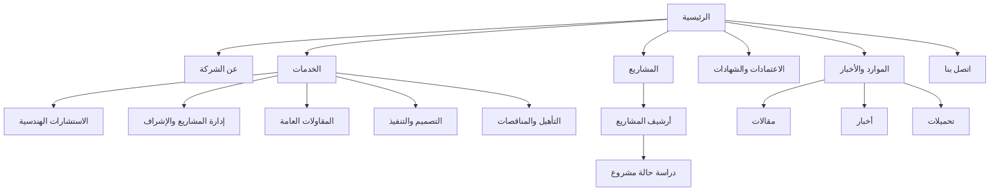

# تقرير تأسيسي لتصميم موقع إلكتروني احترافي لشركة مثلث الإبداع للاستشارات الهندسية والمقاولات العامة

## الملخص التنفيذي

يُظهر تحليل عيّنة مرجعية من عشرة مواقع لشركات كبيرة في الاستشارات الهندسية والمقاولات، عربية ودولية، أن المواقع الأقوى في هذا القطاع لا تكتفي بالعرض التعريفي العام؛ بل تبني الثقة والتحويل عبر ثلاثة محاور متكررة: أرشيف مشاريع قوي يمكن تصفحه بسهولة، هيكلة خدمات واضحة حسب السوق أو نوع الخدمة، ومسارات اتصال احترافية تتجاوز صفحة “اتصل بنا” التقليدية إلى محدد مكاتب، أو طلب عرض، أو العثور على خبير، أو تصنيف الاستفسار من البداية. هذا النمط ظهر بوضوح عبر مواقع مثل **entity["company","AECOM","infrastructure firm"]** و**entity["company","Jacobs","engineering consultancy"]** و**entity["company","WSP","engineering consultancy"]** و**entity["company","Dar Al-Handasah","multidisciplinary consultancy"]** و**entity["company","Khatib & Alami","design consultancy"]** و**entity["company","Arab Engineering Bureau","qatar consultancy"]**. citeturn8view0turn8view1turn25view0turn9view0turn15search1turn29view0

بالنسبة لموقع مثلث الإبداع، فإن أفضل نقطة انطلاق ليست بناء موقع ضخم أو بوابات معقدة، بل إطلاق موقع مؤسسي قوي ومقنع، يركز على: تعريف واضح بالشركة، صفحات خدمات مفهومة، دراسات حالة/مشاريع موثقة بصريًا، عناصر ثقة مهنية مثل الاعتمادات والملف التعريفي والوثائق القابلة للتحميل، ونماذج اتصال وطلب عرض منظمة. إذا كان الاستهداف محليًا أو إقليميًا، فالمسار الأنسب هو موقع عربي أولًا أو ثنائي اللغة (عربي/إنجليزي)، مع بنية محتوى قابلة للتوسع لاحقًا دون إعادة بناء كاملة. توصي المراجع الرسمية من entity["company","Google","search and web services"] أيضًا بأن يكون الموقع متجاوبًا Responsive، واضح البنية، ويدعم النسخ اللغوية المترجمة عبر `hreflang` إذا تعددت اللغات. citeturn16search0turn16search8turn24search0turn24search3

فنيًا، التوصية الأقوى لمرحلة الإطلاق الأولى هي بناء مخصص على WordPress مع أنواع محتوى مهيكلة للخدمات والمشاريع والتحميلات، وتكامل مع أدوات القياس والبحث، وتسريع عبر CDN، وتأمين عبر HTTPS ورؤوس أمان وسياسة تحديث منتظمة. هذا المسار يجمع بين سهولة الإدارة، وقابلية التوسع، وإمكانية تنفيذ أرشيف مشاريع وصفحات خدمات قوية دون تعقيد زائد. citeturn18search0turn18search4turn18search1turn19search13turn19search2turn16search3turn16search7turn19search4turn20search6

## حدود البحث والافتراضات

هذه الدراسة لا تتعامل مع “أقوى الشركات” بوصفها ترتيبًا ماليًا نهائيًا واحدًا، بل باعتبارها عيّنة مقارنة من شركات عالمية وإقليمية ذات حضور قوي، بعضها يتكرر في قوائم ENR الحديثة لأكبر شركات التصميم والاستشارات، إلى جانب شركات عربية/إقليمية ذات مواقع مرجعية ناضجة ومفيدة للتعلم المقارن. هذا يجعل التقرير مناسبًا لبناء قرار تصميمي عملي، حتى لو لم يكن تصنيفًا ماليًا شاملًا لكل السوق. citeturn0search2turn0search3turn30search2turn15search6turn28view0

البيانات غير المحددة في طلبكم، والتي تؤثر مباشرة في القرار النهائي للتصميم، هي:

| البند غير المحدد | أثره على قرار التصميم |
|---|---|
| الميزانية | تحدد إن كان التنفيذ سيكون قالبًا مخصصًا خفيفًا، أو بناءً مخصصًا بالكامل، أو مع تكاملات مؤسسية أوسع |
| عدد اللغات | يحدد بنية الروابط، وإدارة المحتوى، وآلية الترجمة، وضرورة `hreflang` |
| النطاق الجغرافي المستهدف | يحدد الحاجة إلى SEO محلي لمدينة واحدة، أو صفحات فروع، أو استهداف إقليمي |
| نطاق الخدمات الفعلي | يحدد هيكل صفحات الخدمة: هل الشركة تركز على التصميم، الإشراف، إدارة المشاريع، المقاولات العامة، أم جميعها |
| عدد الفروع/المكاتب | يحدد الحاجة إلى صفحات Locations وخريطة متعددة الفروع |
| الحاجة إلى بوابة عملاء/وظائف/دفع | تؤثر في تعقيد المرحلة الأولى بشكل كبير |
| توافر صور مشاريع أصلية ووثائق اعتماد | يؤثر مباشرة في مستوى الثقة والاحترافية عند الإطلاق |

وبناءً على غياب هذه التفاصيل، يفترض هذا التقرير أن الهدف الأساسي للموقع في مرحلته الأولى هو: **التعريف المؤسسي + عرض الخدمات + بناء الثقة + إبراز المشاريع + توليد فرص تواصل وطلبات عروض**، وليس إدارة مناقصات أو بوابة تشغيلية معقدة.

## تحليل المواقع المرجعية

الاستنتاج الأهم من المقارنة أن المواقع الأفضل في هذا المجال تضع **المشروع** في قلب التجربة، لا في ذيلها. كما أن “الثقة” في القطاع الهندسي لا تُبنى غالبًا عبر اقتباسات تسويقية قصيرة، بل عبر مزيج من المشاريع المنجزة، والجوائز، والاعتمادات، والملفات التعريفية، والتقارير، ومؤشرات الانتشار الجغرافي، ووسائل الاتصال المنظمة. citeturn27search2turn25view0turn12search1turn31search3turn29view0turn30search5

### أمثلة دولية

| الشركة | البلد | رابط الموقع | الصفحات والميزات البارزة | عناصر UI المميّزة | نقاط القوة | نقاط الضعف | التحقق |
|---|---|---|---|---|---|---|---|
| **entity["company","AECOM","infrastructure firm"]** | الولايات المتحدة | [aecom.com](https://aecom.com/) | About، Markets، Services، Projects، Offices، Contact، Insights، News، Blog | قائمة رئيسية واسعة لكن واضحة، بطاقات مشاريع، بنية “خدمات + رؤى + مشاريع” متوازنة | توازن ممتاز بين الأعمال والمحتوى القيادي والمكاتب | الدعوة التجارية المباشرة أقل بروزًا من مواقع التحويل الصريحة | citeturn8view0turn27search1turn27search2turn27search3 |
| **entity["company","Jacobs","engineering consultancy"]** | الولايات المتحدة | [jacobs.com](https://www.jacobs.com/) | Company Overview، End Markets، Products & Technologies، Projects، Newsroom، Locations، Contact | تنظيم قوي حسب الأسواق، بحث واضح، تجربة مؤسسية مرتبة | ممتازة في توضيح القطاعات ونقاط الاتصال والمواقع | الطابع المؤسسي مرتفع وقد يبدو أقل دفئًا لشركة متوسطة تبحث عن طابع أقرب | citeturn8view1turn26search0turn26search1turn26search2 |
| **entity["company","WSP","engineering consultancy"]** | كندا | [wsp.com/en-gl](https://www.wsp.com/en-gl/) | Projects مع فلاتر، Insights، Send a message، Request for proposal، Find an expert، Offices | من أوضح المواقع في CTA، فلاتر مشاريع، تصنيف خدمات عميق، مسارات تواصل متعددة | الأفضل تجاريًا في تحويل الزيارة إلى تواصل حقيقي | كثافة المعلومات عالية وتحتاج تبسيطًا في النسخة الأولى لموقع شركتكم | citeturn25view0turn25view1turn25view2 |
| **entity["company","AtkinsRéalis","engineering services"]** | كندا | [atkinsrealis.com/en](https://www.atkinsrealis.com/en) | About us، Services، Projects مع فلاتر، Contact، Careers، Sustainability download center، تقارير وتحميلات | مزج قوي بين التحرير المؤسسي والمشاريع والتقارير | مركز تحميلات قوي جدًا ويصلح مرجعًا لصفحة “ملف الشركة/التحميلات” | المحتوى المعرفي مكثف وقد يربك جمهورًا يبحث عن معلومات سريعة | citeturn13view0turn14view1turn14view2turn14view3turn12search1turn12search2 |
| **entity["company","Bechtel","epc contractor"]** | الولايات المتحدة | [bechtel.com](https://www.bechtel.com/) | Engineering، Procurement، Construction، Project Management، Projects، Contact بنموذج موضوعي، Safety، Quality، Ethics | تصميم يرتكز على الثقة والانضباط، شرائح خدمات واضحة | ممتاز في إبراز مصداقية المقاول الكبير وعناصر الجودة والسلامة | أقل غنى من WSP أو AECOM في تصفح المشاريع والفلاتر على الواجهة العامة | citeturn8view3turn6search1turn6search4turn6search8 |

### أمثلة عربية وإقليمية

| الشركة | البلد | رابط الموقع | الصفحات والميزات البارزة | عناصر UI المميّزة | نقاط القوة | نقاط الضعف | التحقق |
|---|---|---|---|---|---|---|---|
| **entity["company","Dar Al-Handasah","multidisciplinary consultancy"]** | لبنان | [dar.com](https://www.dar.com/) | Work، Insights، News، Publications، About، Contact، Careers، تصنيف حسب Markets وExpertise | أسلوب مؤسسي رصين، بنية خبرات وأسواق شديدة الوضوح، نشرات ومنشورات | مرجع ممتاز لصفحة المشاريع والتحميلات والمنهجية | دعوة البيع المباشرة أقل حضورًا من المواقع الأمريكية الأكثر هجومية تجاريًا | citeturn9view0turn30search0turn30search2turn30search5 |
| **entity["company","Khatib & Alami","design consultancy"]** | لبنان | [khatibalami.com](https://www.khatibalami.com/) | Markets، Services، Projects، Insights (Blogs/Whitepapers/Articles)، About، Careers، News، Contact | رسالة لفظية حديثة، بنية مشاريع/خدمات/أفكار متوازنة، اشتراك في التحديثات | قريب جدًا مما تحتاجه شركة عربية تريد صورة حديثة واحترافية | العمق الكبير للمحتوى قد يزيد عدد النقرات قبل الوصول إلى الإجراء التجاري | citeturn15search1turn15search3turn15search6turn15search7turn15search0 |
| **entity["company","Hassan Allam Holding","engineering group"]** | مصر | [hassanallam.com](https://www.hassanallam.com/) | About/History، Group structure، News، Contact مع مكاتب متعددة، Careers | قوة سردية في الإرث والخبرة، عرض هيكل المجموعة، انتشار جغرافي ظاهر | مفيد جدًا كشركة مقاولات/مجموعة أعمال في بناء الثقة والانتشار | أقل تفصيلاً في “أرشيف دراسة الحالة” مقارنة ببيوت الاستشارات | citeturn28view0turn28view1turn28view2turn8view6 |
| **entity["company","Arab Engineering Bureau","qatar consultancy"]** | قطر | [aeb-qatar.com](https://aeb-qatar.com/) | About، Services، Projects by type، Certificates، Corporate Video، Contact، Tenders & Projects، Careers، Newsletter | طبقة ثقة قوية: شهادات، فيديو مؤسسي، إيميل مناقصات، أرقام ومكاتب | ممتاز في منطق الاعتمادات والـ prequalification | النبرة البصرية أكثر تقليدية وأقل تحررًا في المحتوى التحليلي | citeturn8view7turn29view0turn29view1 |
| **entity["company","KEO International Consultants","design engineering consultancy"]** | الكويت | [keo.com](https://www.keo.com/) | Profile، People، Rankings + Awards، ESG، Services، Projects، News، Capability Statement، Careers، Contact | صور قوية، تصنيف مشاريع واسع، ملف تعريفي قابل للتحميل، إبراز الجوائز | من أفضل النماذج الإقليمية لشركة استشارية حديثة بصريًا | طول السلايدر وكثرة العناصر في الواجهة قد يبطئ الفهم السريع للزائر الجديد | citeturn8view2turn31search3turn32search1turn31search2 |

على مستوى الأنماط العامة، تتكرر خمس ملاحظات حاسمة. أولًا: صفحة المشاريع ليست صفحة فرعية، بل مركز الثقل. ثانيًا: الخدمات تُعرّف بما يهم العميل، لا فقط بما يطابق الهيكل الإداري الداخلي. ثالثًا: عناصر الثقة المؤثرة في هذا القطاع هي الاعتمادات، الجوائز، الملفات التعريفية، الأخبار المهنية، وسجل التنفيذ، أكثر من اقتباسات “عملاء سعداء”. رابعًا: أفضل مسارات التواصل هي المنظمة تصنيفيًا، مثل “طلب عرض”، “حدد فئة استفسارك”، “اعثر على مكتب”، أو “أرسل للمناقصات”. خامسًا: بوابة العميل العامة ليست عنصرًا متكررًا في الواجهة الرئيسية للمواقع المرجعية؛ ما يعني أن إطلاق موقعكم ينبغي أن يركز أولًا على **موقع بيع مؤسسي Credibility Site** قبل التفكير في بوابة تشغيلية. citeturn25view0turn25view2turn29view0turn31search2turn30search10turn15search3

## التوصيات العملية لموقعكم

الهيكل الأنسب لموقع مثلث الإبداع هو موقع مؤسسي “يربح الثقة بسرعة” ثم يقود إلى التفاعل. لذلك، العناصر التالية ليست كماليات، بل مكوّنات أساسية في النسخة الأولى:

| العنصر | ما يجب أن يوجد في موقعكم | لماذا هو مهم | الإسناد |
|---|---|---|---|
| قيمة الشركة في أول شاشة | عنوان قوي يوضح: ماذا تقدمون، لمن، وبأي ميزة | لأن الزائر يجب أن يفهم الشركة خلال ثوانٍ | citeturn15search1turn8view1turn8view6 |
| صفحة خدمات رئيسية + صفحات فرعية | صفحة جامعة للخدمات، ثم صفحة مستقلة لكل خدمة رئيسية | هذا النمط شائع وواضح الفهم في المواقع المرجعية | citeturn8view0turn25view1turn15search7turn29view0 |
| أرشيف مشاريع | شبكة مشاريع مع تصنيف حسب القطاع/النوع/الموقع/الحالة | لأن المشاريع هي أهم أداة ثقة في هذا القطاع | citeturn27search2turn25view0turn12search1turn32search12turn29view1 |
| صفحة دراسة حالة مفصلة | لكل مشروع: العميل، الموقع، النطاق، التحدي، الحل، النتائج، صور | لأن العرض السردي للمشروع أكثر إقناعًا من معرض صور فقط | citeturn29view1turn27search9turn12search11 |
| شهادات واعتمادات وملف شركة | تراخيص، شهادات، HSE، capability statement، ملفات PDF | الشركات المرجعية تعتمد بقوة على هذا النوع من الثقة | citeturn29view0turn31search2turn31search3turn12search2turn30search10 |
| صور ومعرض وفيديو | صور مشاريع فعلية، صور موقع/فريق، فيديو قصير أو درون عند الإمكان | لأن القطاع بصري وثقة التنفيذ تُرى ولا تُقال فقط | citeturn8view7turn29view1turn8view2 |
| نموذج اتصال احترافي | تصنيف نوع الطلب + الخدمة + الموقع + الميزانية + الوصف | لتحسين جودة الـ leads وتوجيهها فورًا | citeturn25view2turn29view0turn28view1 |
| نموذج طلب عرض سعر | مستقل عن “اتصل بنا” مع حقول تقنية كافية | لأن المواقع الأقرب للبيع المؤسسي تعطي مسارًا واضحًا للعرض | citeturn25view2 |
| خرائط وفروع | خريطة + صفحة مكتب/فرع لكل موقع إن وُجد | مهم للثقة المحلية والإقليمية وSEO المحلي | citeturn26search1turn27search1turn28view1turn20search1turn20search10 |
| مركز تحميلات | بروفايل الشركة، كتيبات الخدمات، شهادات، نماذج، سياسات | مفيد للمناقصات والتأهيل الأولي | citeturn31search3turn12search2turn30search7 |
| مركز معرفي خفيف | أخبار، مقالات قليلة لكن جيدة، تحديثات مشاريع، أوراق بيضاء عند الحاجة | يقوي SEO والسلطة المهنية إذا نُفذ باعتدال | citeturn27search3turn26search0turn15search3turn25view1 |
| لغات | عربي + إنجليزي كخيار افتراضي إذا كان هناك استهداف إقليمي/شراكات خارجية | لأن النسخ المترجمة تحتاج إدارة صحيحة تقنيًا | citeturn16search0turn16search8turn23search8 |
| SEO محلي | ملف نشاط تجاري، بيانات منظمة، خرائط، صفحات فروع عند الحاجة | لأن الظهور المحلي لا يعتمد على النصوص فقط | citeturn20search0turn20search1turn20search10turn20search20 |
| سرعة وموبايل | تجاوب كامل، ضغط صور، CDN، Lazy Load خارج الشاشة، CWV جيدة | لأن Google توصي بالتصميم المتجاوب وتجربة صفحة جيدة | citeturn24search0turn16search1turn16search2turn16search10turn19search13turn35search1turn35search5 |
| نظام إدارة محتوى | أنواع محتوى واضحة: خدمات، مشاريع، تحميلات، أخبار، شهادات | لتسهيل الإدارة والنمو دون فوضى | citeturn18search0turn18search4turn18search1turn18search17 |

خريطة الموقع المقترحة يجب أن تكون واضحة وهرمية، بحيث لا يتجاوز المستوى الأول سبعة عناصر في الملاحة الأساسية. المقترح التالي يوازن بين سهولة التصفح، وحاجات المبيعات، والمرونة المستقبلية:

| الصفحة | الهدف | المحتوى الأساسي |
|---|---|---|
| الرئيسية | تقديم سريع ومقنع | رسالة الشركة، الخدمات، أبرز المشاريع، عناصر الثقة، CTA |
| عن الشركة | بناء الثقة المؤسسية | من نحن، الرؤية، الرسالة، القيم، التاريخ، القيادات، الاعتمادات |
| الخدمات | شرح نطاق العمل | فئات الخدمات الرئيسية وروابط إلى صفحاتها |
| صفحة خدمة فرعية | دعم القرار | وصف الخدمة، نطاقها، مراحل العمل، المخرجات، المشاريع ذات الصلة، CTA |
| المشاريع | إثبات الخبرة | أرشيف مشاريع مع تصنيفات |
| صفحة مشروع/دراسة حالة | إثبات عملي مفصل | التحدي، الحل، الصور، النتائج، الخدمة المقدمة، CTA |
| الاعتمادات والشهادات | Prequalification وثقة | التراخيص، الجوائز، سياسات الجودة، HSE، ملفات التحميل |
| المركز المعرفي/الأخبار | السلطة المهنية وSEO | مقالات، أخبار مشاريع، تحديثات |
| الوظائف | جذب كفاءات عند الحاجة | فرص العمل، ثقافة الشركة، نموذج التقديم |
| اتصل بنا | التحويل | بيانات الاتصال، الخريطة، نموذج عام، نموذج طلب عرض |

الملاحة المقترحة في المستوى الأول هي: **الرئيسية، عن الشركة، الخدمات، المشاريع، الاعتمادات، الموارد/الأخبار، اتصل بنا**، مع زر CTA ثابت مثل **“اطلب استشارة أولية”** أو **“اطلب عرض سعر”**. وإذا كانت الخدمات كثيرة، فلتكن تحت قائمة منسدلة بسيطة، لا Mega Menu معقدة في النسخة الأولى.

المخطط التالي يقترح خريطة الموقع بصيغة mermaid:

أما الصفحة الرئيسية، فالأفضل أن تُبنى كسلسلة إقناع منطقية تبدأ بالقيمة، ثم تنتقل بسرعة إلى البرهان، ثم تنتهي بالتحويل. الترتيب المقترح هو:

| قسم الصفحة الرئيسية | الهدف | نص مقترح مختصر | CTA | عنصر بصري مقترح |
|---|---|---|---|---|
| Hero | توضيح من أنتم وماذا تقدمون | **حلول هندسية ومقاولات تُنفذ بثقة وتُدار بدقة** | اطلب استشارة أولية / استعرض مشاريعنا | صورة مشروع حقيقي أو لقطة تنفيذ/موقع |
| شريط الثقة السريع | إثبات سريع | سنوات الخبرة، عدد المشاريع، القطاعات، نطاق التغطية | — | عدادات بسيطة أو شريط أرقام |
| نبذة مختصرة | تعريف بالشركة | “نقدّم خدمات الاستشارات الهندسية والمقاولات العامة...” | اعرف أكثر | صورة فريق/اجتماع مشروع |
| الخدمات | فهم نطاق العمل | بطاقات قصيرة للخدمات الرئيسية | عرض جميع الخدمات | أيقونات هندسية بسيطة |
| مشاريع مختارة | البرهان | 3–6 مشاريع مختارة مع صورة ووصف سطرين | جميع المشاريع | صور Before/After أو صور خارجية قوية |
| لماذا نحن | التمييز | الجودة، الالتزام، الإدارة، السلامة، الحلول المتكاملة | تواصل معنا | أيقونات/أرقام/اعتمادات |
| الاعتمادات والشهادات | الثقة المؤسسية | تراخيص، شهادات، HSE، الملف التعريفي | تحميل ملف الشركة | شعارات اعتماد/شهادات |
| آلية العمل | إزالة الغموض | دراسة، تصميم، تنفيذ، إشراف، تسليم | ابدأ مشروعك | مخطط خطوات بسيط |
| CTA نهائي | التحويل | **هل تبحث عن شريك هندسي موثوق لمشروعك القادم؟** | اطلب عرض سعر | خلفية مشروع/لون قوي |
| تواصل وخريطة | إنهاء المسار | بيانات الاتصال والموقع وساعات العمل | أرسل استفسارك | خريطة وبيانات فرع |

نصوص العناوين المقترحة للصفحة الرئيسية يمكن أن تكون كالتالي:
- **العنوان الرئيسي:** حلول هندسية ومقاولات تُبنى على الدقة والالتزام
- **العنوان الفرعي:** نساعد عملاءنا على تحويل الأفكار إلى مشاريع قابلة للتنفيذ، من الدراسة والتصميم وحتى الإشراف والتنفيذ والتسليم
- **CTA الأساسي:** اطلب استشارة أولية
- **CTA الثانوي:** استعرض مشاريعنا

## المتطلبات الفنية وخطة التنفيذ

المتطلبات الفنية يجب أن تُصاغ بحيث تخدم ثلاثة أهداف في آن واحد: سهولة إدارة المحتوى، قوة الظهور في البحث، وسلامة الأداء والأمان. التوصية الأساسية هي كما يلي:

| البند الفني | التوصية | لماذا هذه التوصية مناسبة | التحقق |
|---|---|---|---|
| CMS رئيسي | WordPress ببناء مخصص وخانات محتوى مهيكلة للخدمات والمشاريع والتحميلات | يدعم Custom Post Types، ويحافظ على قابلية نقل المحتوى، ويوفر إدارة وسائط واضحة | citeturn18search0turn18search4turn18search1turn18search17 |
| إدارة اللغات | عربي/إنجليزي عبر WPML إن تقرر اعتماد لغتين | WPML يدعم ترجمة الصفحات، الـ custom post types، القوائم، والوسائط | citeturn23search0turn23search4turn23search8 |
| بديل مؤسسي | Drupal إذا كانت الحاجة عالية للموافقات والأدوار وسير التحرير | Drupal يوفر تعدد لغات على مستوى النواة، ويدعم العربية RTL، والأدوار، وContent Moderation، وMedia Library | citeturn33search3turn33search0turn33search1turn33search2 |
| الاستضافة | VPS مُدار أو استضافة سحابية مع بيئة staging ونسخ احتياطي يومي | للحصول على تحكم وأمان وقابلية توسع دون تعقيد كبير | — |
| CDN والأداء | استخدام entity["company","Cloudflare","cdn and security"] أو ما يعادله | CDN والتخزين المؤقت وتحسين الصور يقللون زمن الوصول ويحسنون التحميل | citeturn19search13turn19search1 |
| HTTPS | شهادة TLS مفعّلة منذ اليوم الأول | HTTPS عنصر أساسي في الأمان والثقة | citeturn19search2turn19search10 |
| رؤوس الأمان | Secure Headers + CSP + سياسة تحديث ومراجعة صلاحيات | لتقليل المخاطر الشائعة في الويب الحديث | citeturn16search3turn16search7turn16search23 |
| حماية النماذج | reCAPTCHA أو حل مماثل ضد السبام مع rate limiting | النماذج العامة في المواقع المؤسسية هدف شائع للرسائل المزعجة | citeturn19search3turn19search7 |
| SEO تقني | XML sitemap، Search Console، روابط وصفية، structured data، responsive design | هذه من أقوى الأساسيات التقنية لجعل الموقع قابلاً للفهرسة والظهور | citeturn20search2turn20search6turn24search3turn20search5turn24search0 |
| SEO محلي | Business Profile + LocalBusiness/Organization schema + صفحات فروع (إن وجدت) | لدعم الظهور في البحث المحلي والخرائط ولوحات المعرفة | citeturn20search0turn20search1turn20search9turn20search10 |
| الأداء | استهداف CWV جيدة: LCP ≤ 2.5s، INP ≤ 200ms، CLS ≤ 0.1 | هذه هي العتبات الإرشادية لتجربة أفضل بحسب Google/web.dev | citeturn35search1turn35search2turn35search5turn35search6 |
| تحسين الصور | ضغط الصور، تحديد أبعادها، وعدم Lazy Load للصورة البطولية Hero، مع Lazy Load لباقي الصور | الصور غير المحسنة سبب رئيسي في ضعف LCP وCLS | citeturn16search2turn16search10turn16search14turn35search4turn35search6 |
| التحليلات | GA4 + Search Console + Tag Manager | لقياس الزيارات والأحداث والنماذج ومصدر الاستفسارات | citeturn19search0turn19search4turn20search6 |
| CRM | تكامل النماذج مع entity["company","HubSpot","crm platform"] أو CRM مشابه | HubSpot يدعم النماذج والتضمين والتكامل مع الواجهات الخارجية | citeturn17search3turn17search7 |
| الدفع | لا يُنصح ببوابة دفع في المرحلة الأولى إلا إذا كان هناك منتج مدفوع واضح | لأن معظم مواقع هذا القطاع تركز على lead generation لا البيع المباشر | citeturn25view2turn26search2turn29view0 |

خطة المحتوى الأولية المقترحة للإطلاق يمكن أن تكون على هذا النحو:

| الصفحة | المحتوى المختصر | الأصول المطلوبة |
|---|---|---|
| الرئيسية | عرض الشركة، الخدمات الأساسية، المشاريع المختارة، عناصر الثقة، CTA | 4–6 صور قوية، أرقام أساسية، شعارات عملاء/اعتمادات |
| عن الشركة | نبذة، الرؤية، الرسالة، القيم، الفريق القيادي، الاعتمادات | صور مكتب/فريق، ملف تعريف، تراخيص |
| الخدمات | ملخص الخدمات وروابط للصفحات الفرعية | وصف واضح لكل خدمة |
| خدمة فرعية لكل خدمة | ما الذي نقدمه، لمن، آلية العمل، المخرجات، مشاريع مرتبطة | صور/أيقونات/مشروع مرجعي |
| المشاريع | أرشيف مشاريع مع فلاتر | صور مشاريع، تصنيفات |
| 3–6 دراسات حالة أولية | مشروع نموذجي لكل فئة خدمة/قطاع | صور، نطاق العمل، النتائج |
| الاعتمادات والتحميلات | تراخيص، شهادات، بروفايل الشركة، HSE، نماذج | PDF نهائي معتمد |
| الأخبار/المقالات | 3 مقالات افتتاحية أو أخبار إطلاق فقط | مقالات قصيرة وصور |
| اتصل بنا | بيانات الاتصال، خريطة، نموذج عام، نموذج طلب عرض | بيانات المكاتب، إيميلات التوجيه |
| الوظائف | اختياري في الإطلاق الأول | بريد التوظيف أو رابط خارجي |

الجدول الزمني الواقعي لموقع احترافي أولي في حال توفر المحتوى والقرار السريع يتراوح عادة بين **6 و8 أسابيع**:

| المرحلة | المدة التقريبية | المخرجات |
|---|---|---|
| الاكتشاف وجمع المحتوى | 3–5 أيام | قائمة الصفحات، الأصول، القرار النهائي للخدمات واللغات |
| الهيكلة وWireframes | 5–7 أيام | خريطة الموقع، Wireframes، الملاحة |
| التصميم البصري UI | 7–10 أيام | تصميم الصفحة الرئيسية والنماذج الداخلية |
| كتابة/مراجعة المحتوى | 5–7 أيام | النصوص النهائية بالعربية والإنجليزية إن وجدت |
| التطوير | 10–15 يومًا | بناء الصفحات، CMS، النماذج، التتبعات |
| إدخال المحتوى والاختبار | 4–6 أيام | إدخال المحتوى، QA، اختبار الموبايل والسرعة |
| الإطلاق | 1–2 يوم | نقل مباشر، ربط DNS، Search Console، Analytics |
| الصيانة الشهرية | مستمر | تحديثات، نسخ احتياطي، تقارير، تحسين SEO |

وبخصوص الصور والمرئيات، أفضل ممارسة في هذا القطاع هي البدء أولًا بما تملكه الشركة من صور تنفيذ ومواقع فعلية ووثائق مصورة. وإذا احتجتم إلى مصادر داعمة أو صور انتقالية فيمكن اعتماد المصادر التالية:

| المصدر | الاستخدام الأنسب | الرابط | ملاحظة |
|---|---|---|---|
| تصوير مشاريع الشركة | Hero، المشاريع، دراسات الحالة، عن الشركة | — | الأفضل دائمًا لأنه يبني مصداقية حقيقية |
| ArabStock | صور عربية/خليجية مناسبة للسياق المحلي | [arabsstock.com](https://arabsstock.com/en) | مكتبة عربية خليجية متخصصة بالمحتوى البصري | citeturn21search0 |
| Unsplash | صور عامة داعمة أو mood boards أو placeholders | [unsplash.com](https://unsplash.com/) | الترخيص يسمح بالاستخدام المجاني التجاري في معظم الحالات | citeturn21search2 |
| Pexels | صور وفيديو مجانية للاستخدام السريع | [pexels.com](https://www.pexels.com/) | مناسب للنسخ الأولية والمرئيات الثانوية | citeturn22search0turn22search8 |
| Adobe Stock | صور مدفوعة أكثر تحكمًا واحترافية | [stock.adobe.com](https://stock.adobe.com/) | مناسب للـ hero المرخّص أو الخلفيات عالية الجودة | citeturn22search3turn22search7 |

## نصوص عربية جاهزة للنسخ

فيما يلي نماذج نصية عربية احترافية قابلة للنسخ والتعديل المباشر. وقد تركتُ بعض المواضع بين أقواس مربعة لتعبئة المعلومات الخاصة بالشركة التي لم تُحدد في الطلب.

**الصفحة الرئيسية**

**العنوان الرئيسي**  
مثلث الإبداع للاستشارات الهندسية والمقاولات العامة

**عنوان فرعي قوي**  
حلول هندسية ومقاولات تُنفّذ بدقة، وتُدار باحتراف، وتُسلَّم بثقة.

**نص تمهيدي**  
نقدّم في مثلث الإبداع خدمات الاستشارات الهندسية والمقاولات العامة وإدارة المشاريع والإشراف الفني، بمنهج عملي يربط بين جودة التصميم، وكفاءة التنفيذ، وحسن إدارة الوقت والتكلفة. نعمل مع الأفراد والجهات الحكومية والخاصة والمطورين والمستثمرين لنحوّل الأفكار إلى مشاريع واضحة، قابلة للتنفيذ، ومبنية على معايير فنية عالية.

**أزرار الدعوة إلى الإجراء**  
اطلب استشارة أولية  
استعرض مشاريعنا

**قسم من نحن باختصار**  
نحن شركة متخصصة في تقديم الحلول الهندسية والتنفيذية المتكاملة، نؤمن بأن نجاح أي مشروع يبدأ بفهم دقيق للاحتياج، ثم تخطيط مدروس، ثم تنفيذ منضبط يضمن الجودة والالتزام. لهذا نعمل على كل مشروع بروح الشراكة، ونركز على تقديم قيمة عملية حقيقية في كل مرحلة من مراحل العمل.

**قسم الخدمات**  
نقدّم مجموعة من الخدمات التي تغطي دورة المشروع من البداية إلى التسليم، وتشمل:  
- الاستشارات والدراسات الهندسية  
- التصميم المعماري والإنشائي والخدماتي  
- إدارة المشاريع والإشراف الفني  
- المقاولات العامة والتنفيذ  
- أعمال التطوير والتأهيل والصيانة  
- إعداد وثائق الطرح والتأهيل والمتابعة

**قسم لماذا نحن**  
لأننا لا ننظر إلى المشروع بوصفه مهمة تنفيذية فقط، بل بوصفه التزامًا مهنيًا يتطلب رؤية هندسية واضحة، وإدارة محكمة، وتواصلًا مسؤولًا، ونتائج يمكن الاعتماد عليها. نحرص على وضوح النطاق، والالتزام بالجدول الزمني، ومتابعة الجودة، وتقديم حلول عملية تناسب احتياجات كل عميل وطبيعة كل مشروع.

**قسم المشاريع المختارة**  
نفتخر بتنفيذ ومتابعة مشاريع في مجالات متعددة تشمل [السكني] و[التجاري] و[الإداري] و[البنية التحتية] و[التأهيل والتطوير]. نعرض في صفحة المشاريع نماذج من أعمالنا مع توضيح نطاق العمل والتحديات والحلول والنتائج.

**قسم الاعتمادات والثقة**  
نلتزم في أعمالنا بالمعايير الفنية والمهنية المعتمدة، ونعمل وفق منهج واضح في الجودة والسلامة والتوثيق والمتابعة. ويمكنكم الاطلاع على ملف الشركة والشهادات والوثائق التعريفية عبر مركز التحميلات.

**CTA نهائي**  
هل لديكم مشروع يحتاج إلى شريك هندسي وتنفيذي موثوق؟  
يسعدنا أن نناقش احتياجاتكم ونقترح عليكم الحل الأنسب.

**زر CTA**  
اطلب عرض سعر

**صفحة عن الشركة**

**عنوان الصفحة**  
عن مثلث الإبداع

**مقدمة الصفحة**  
مثلث الإبداع للاستشارات الهندسية والمقاولات العامة شركة تعمل على تقديم حلول هندسية وتنفيذية متكاملة، تجمع بين الخبرة الفنية، والإدارة العملية، والحرص على الجودة في كل تفصيل. ننطلق من قناعة واضحة بأن المشاريع الناجحة لا تعتمد على التصميم وحده، ولا على التنفيذ وحده، بل على تكامل الرؤية والخبرة والانضباط والمتابعة.

**من نحن**  
نخدم عملاءنا عبر منظومة عمل تبدأ بفهم متطلبات المشروع وأهدافه، ثم تحليل التحديات الفنية والتنفيذية، ثم تقديم الحلول التي تتناسب مع الواقع والميزانية والجدول الزمني. نحن نؤمن بأن دورنا لا يقتصر على إنجاز الأعمال، بل يمتد إلى تقليل المخاطر، ورفع كفاءة القرار، وتحقيق قيمة طويلة الأمد للمشروع.

**رؤيتنا**  
أن نكون من الشركات الموثوقة في تقديم الاستشارات الهندسية والمقاولات العامة، من خلال جودة المخرجات، ووضوح الإجراءات، والالتزام المهني، وبناء علاقات شراكة طويلة المدى مع عملائنا.

**رسالتنا**  
تقديم خدمات هندسية وتنفيذية ذات قيمة حقيقية، تربط بين الفكرة والتصميم والتنفيذ والإشراف، وتُسهم في إنجاز مشاريع ناجحة وآمنة وفعّالة.

**قيمنا**  
- **الاحترافية:** نعمل بمعايير واضحة وإجراءات منضبطة.  
- **الالتزام:** نحترم الوقت والنطاق والمتطلبات المتفق عليها.  
- **الجودة:** نهتم بالتفاصيل لأنها تصنع الفرق في النتيجة النهائية.  
- **الموثوقية:** نبني الثقة عبر الأداء والاستجابة والتواصل الواضح.  
- **السلامة:** نعتبر السلامة عنصرًا أساسيًا في التنفيذ والإشراف.  
- **التطوير:** نتابع أفضل الممارسات والحلول التي ترفع كفاءة العمل.

**كيف نعمل**  
نبدأ كل مشروع بدراسة دقيقة للاحتياج، ثم نضع تصورًا فنيًا وتنفيذيًا واضحًا، ثم ننتقل إلى مراحل العمل وفق خطة مدروسة، مع متابعة مستمرة للجودة والتقدم والمخاطر. هذا النهج يساعدنا على اتخاذ قرارات أفضل، وتجنب التعارضات، وتحقيق تنفيذ أكثر كفاءة.

**القطاعات التي نخدمها**  
نخدم مشاريع في قطاعات متعددة مثل [السكني] و[التجاري] و[الإداري] و[الصناعي] و[الخدمي] و[البنية التحتية] و[إعادة التأهيل والتطوير]، مع قابلية تكييف خدماتنا حسب نوع المشروع وطبيعته ومتطلباته.

**دعوة ختامية**  
إذا كنتم تبحثون عن شريك يجمع بين الرؤية الهندسية والانضباط التنفيذي، فنحن جاهزون لبدء الحوار حول مشروعكم القادم.

**صفحة الخدمات**

**عنوان الصفحة**  
خدماتنا

**مقدمة الصفحة**  
نقدّم في مثلث الإبداع مجموعة متكاملة من الخدمات المصممة لدعم المشاريع في مختلف مراحلها، من الدراسات الأولية والتصميم وحتى الإشراف والتنفيذ والتسليم. ونعمل على تكييف نطاق الخدمة بما يتناسب مع طبيعة المشروع، ومرحلة العمل، واحتياجات العميل.

**خدمة الاستشارات والدراسات الهندسية**  
نوفّر الدراسات والتقارير والتوصيات الفنية التي تساعد العميل على اتخاذ قرارات أفضل في بداية المشروع، بما يشمل مراجعة الاحتياجات، وتحليل المعطيات، وتحديد البدائل، ورفع الجاهزية الفنية والتنفيذية.

**خدمة التصميم الهندسي**  
نقدّم خدمات التصميم المعماري والإنشائي والخدماتي وفق متطلبات المشروع والاشتراطات التنظيمية، مع التركيز على الكفاءة الوظيفية، وجودة التفاصيل، وقابلية التنفيذ، والتنسيق بين التخصصات المختلفة.

**خدمة إدارة المشاريع والإشراف الفني**  
نساعد العملاء على إدارة المشاريع بكفاءة عبر التخطيط والمتابعة والتنسيق والرقابة الفنية، بما يسهم في رفع جودة التنفيذ، وضبط الوقت، وتقليل الهدر، وتحسين التواصل بين جميع الأطراف.

**خدمة المقاولات العامة والتنفيذ**  
ننّفذ الأعمال وفق نطاق واضح وجداول زمنية مدروسة، مع الالتزام بمعايير الجودة والسلامة، وإدارة الأعمال الميدانية ومراحل التنفيذ بشكل احترافي يضمن وضوح المسؤوليات ودقة الإنجاز.

**خدمة التطوير والتأهيل والصيانة**  
ننفذ أعمال التحديث والتأهيل والتحسين للمباني والمرافق، ونعمل على رفع الكفاءة التشغيلية والجمالية والوظيفية للمشروع بما يتناسب مع أهداف المالك وطبيعة الاستخدام.

**خدمة وثائق الطرح والتأهيل**  
نساعد في إعداد المستندات الفنية والتعريفية المطلوبة للطرح أو التأهيل أو التعاقد، بما في ذلك المواصفات، والجداول، ونطاقات العمل، وملفات التعريف، ومرفقات الاعتماد ذات الصلة.

**فقرة ختامية**  
نؤمن أن كل مشروع له متطلباته الخاصة، لذلك نحرص على بناء نطاق خدمة مناسب، واضح، وقابل للتنفيذ منذ البداية. ويمكنكم التواصل معنا لمناقشة احتياجكم واختيار النموذج الأنسب للخدمة.

**زر CTA**  
اطلب عرض خدمة

**صفحة مشروع أو دراسة حالة**

**عنوان المشروع**  
[اسم المشروع]

**وصف قصير**  
مشروع [سكني/تجاري/إداري/بنية تحتية] يقع في [المدينة/المنطقة]، تولّت فيه مثلث الإبداع نطاقًا يشمل [التصميم/الإشراف/إدارة المشروع/التنفيذ].

**نظرة عامة**  
جاء هذا المشروع استجابةً لحاجة العميل إلى [وصف الحاجة أو الهدف]. وقد تطلّب العمل معالجة عدد من الجوانب الفنية والتنفيذية منذ المراحل الأولى، بما يضمن وضوح الرؤية، وانضباط نطاق العمل، وتحقيق أفضل نتيجة ممكنة ضمن الإطار الزمني والمالي المعتمد.

**التحدي**  
تمثلت أبرز تحديات المشروع في [التحدي الأول] و[التحدي الثاني] و[التحدي الثالث]، وهو ما استدعى إعداد حلول عملية قابلة للتنفيذ، مع تنسيق دقيق بين الأطراف الفنية والتنفيذية، ورفع مستوى المتابعة في المراحل الحرجة من المشروع.

**الحل الذي قدمناه**  
قامت فرقنا بدراسة متطلبات المشروع وتحليل أولوياته، ثم وضعنا منهج عمل متدرج يشمل [الدراسة/التصميم/اعتماد المخططات/إدارة التنفيذ/الإشراف/الاستلام]. وخلال ذلك تم التركيز على جودة التفاصيل، وسرعة المعالجة، ووضوح التقارير، وتحسين كفاءة التنفيذ ميدانيًا.

**نطاق العمل**  
- [بند نطاق 1]  
- [بند نطاق 2]  
- [بند نطاق 3]  
- [بند نطاق 4]

**النتائج**  
أسهمت المعالجة الفنية والإدارية في [تحسين الجودة/تسريع الإنجاز/تقليل الملاحظات/رفع الجاهزية/تحسين التنسيق]، وحقق المشروع نتائج مهمة تمثلت في [نتيجة 1] و[نتيجة 2] و[نتيجة 3].

**بيانات سريعة**  
- **العميل:** [اسم العميل]  
- **الموقع:** [المدينة/الدولة]  
- **القطاع:** [القطاع]  
- **نطاق الخدمة:** [نطاق الخدمة]  
- **مدة المشروع:** [المدة]  
- **الحالة:** [مكتمل/قيد التنفيذ]

**CTA ختامي**  
هل لديكم مشروع مشابه؟  
يمكننا مساعدتكم في دراسة المتطلبات ووضع نطاق عمل مناسب منذ البداية.

**زر CTA**  
تواصل معنا بشأن مشروعك

**صفحة اتصل بنا**

**عنوان الصفحة**  
اتصل بنا

**مقدمة الصفحة**  
يسعدنا استقبال استفساراتكم ومناقشة احتياجات مشاريعكم. سواء كنتم في مرحلة الفكرة الأولية، أو التصميم، أو التنفيذ، أو تبحثون عن شريك هندسي لمتابعة مشروع قائم، يمكنكم التواصل معنا عبر النموذج التالي أو من خلال بيانات الاتصال المباشرة.

**فقرة توجيهية**  
لخدمتكم بشكل أسرع وأكثر دقة، نرجو توضيح نوع الطلب عند التواصل:  
- استشارة هندسية  
- طلب عرض سعر  
- إشراف أو إدارة مشروع  
- مقاولات عامة  
- شراكة أو تعاون  
- استفسار عام

**بيانات الاتصال**  
- **الهاتف:** [رقم الهاتف]  
- **البريد الإلكتروني:** [البريد الإلكتروني]  
- **العنوان:** [العنوان الكامل]  
- **ساعات العمل:** [أيام وساعات العمل]

**نموذج التواصل**  
الاسم الكامل  
اسم الشركة/الجهة  
رقم الجوال  
البريد الإلكتروني  
نوع الخدمة المطلوبة  
موقع المشروع  
الميزانية التقديرية  
وصف مختصر للمشروع  
إرفاق ملف (اختياري)

**نص أسفل النموذج**  
سنراجع طلبكم ونتواصل معكم في أقرب وقت ممكن لتحديد الخطوة التالية بشكل واضح ومناسب لطبيعة المشروع.

**نص الخريطة**  
يمكنكم زيارة مقرنا خلال ساعات العمل الرسمية، كما يمكن ترتيب اجتماع حضوري أو افتراضي بحسب طبيعة الطلب.

**CTA نهائي**  
ابدأ الحديث معنا اليوم، ولنحوّل احتياج مشروعك إلى خطة عمل واضحة وقابلة للتنفيذ.
